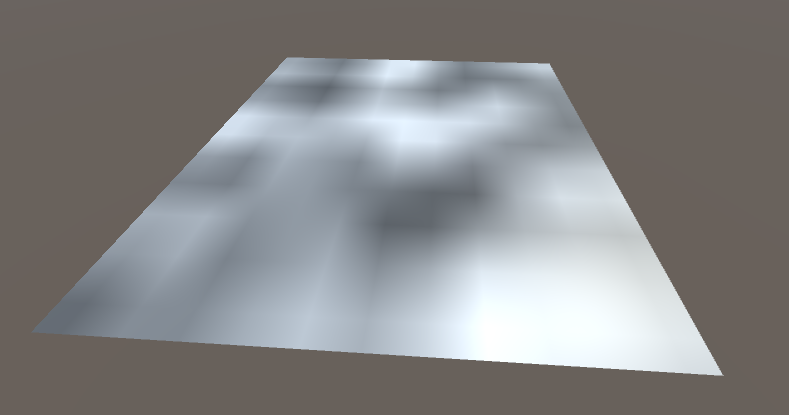
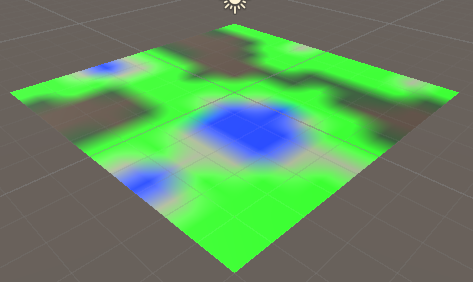
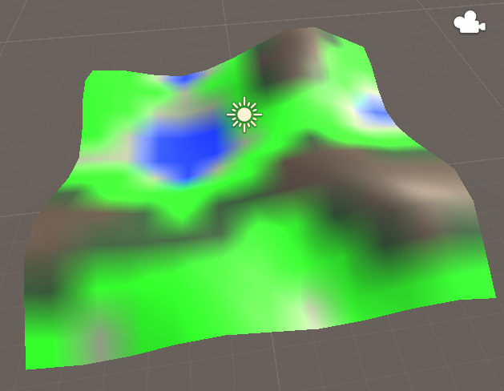
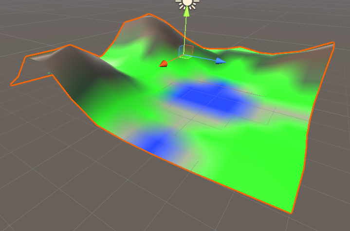
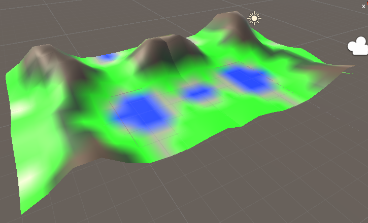
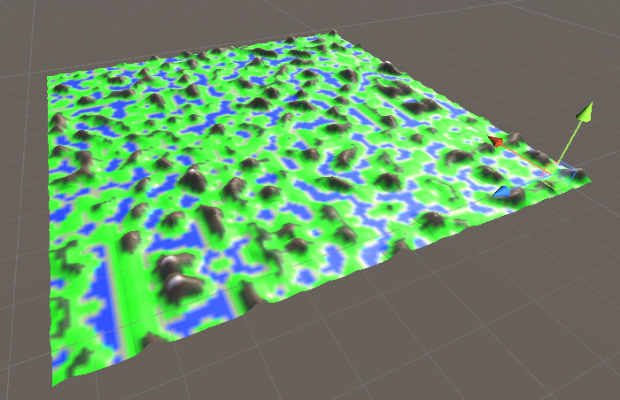
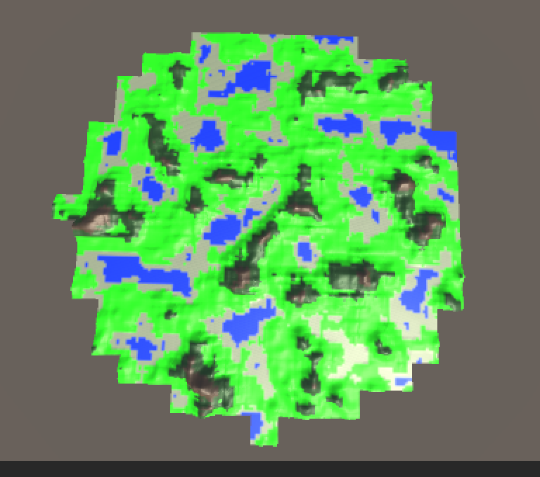
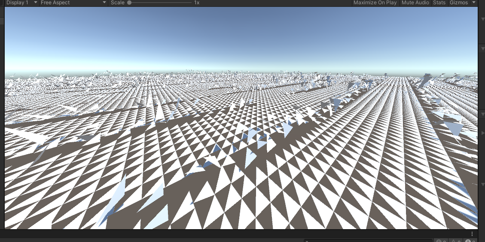

# Terrain Generator

## Controls
- Player Controls
    - <kbd>wasd</kbd> move player laterally/horizontally (relative to camera)
    - <kbd>
- <kbd>wasd</kbd> to translate player laterally/horizontally

## Features
- Player Freecam Movement
    - I used a basic free one off the internet [here](https://gamedevgary.itch.io/flycamcontroller-unity?download).
    - Made a few changes:
        - Made vertical movement relative to world instead of camera
    - Tweaked values
- Chunk-Based Heightmap Generation & Rendering
    - Based on [this tutorial](https://gamedevacademy.org/complete-guide-to-procedural-level-generation-in-unity-part-1/).
    - Note that, for Lab 2, I personally opted to make a maze, so this is a lot of new work for me rather than a reuse of old work. 
    - Note that the "load around the player" and "cull chunks too far from the player" are entirely of my own design; didn't follow a tutorial or anything for those. 
- Secondary Biomes
    - Biomes are chosen based on three perlin maps - height, heat, and moisture. 

## Timeline
### 4/6/21: 12pm - 12:30pm (.5h)
Worked on: 
- Player Movement
- Heightmap Generation
    
### 4/17/21: 3:15pm - 4:30pm (1.25h)
Worked on: 
- Improving Documentation
- Fix Heightmap Generation; was broken coming into today 
- Apply heightmap-based colors (the beginnings of the biome system)
- Apply heights based on the heightmap itself 
- Applying heights from a distribution rather than straight from noise 
- Flatten water out 

Height map being generated:

Actual colors (i.e. biomes) generated just from height:

Actually setting vertex heights from noise values:

Defining a height distribution, rather than pulling height directly from noise:

Makes the landscape look more realistic and flattens out the water some:

### 4/17/21: 7:15pm - 8:15pm (1h)
Worked on: 
- Expand terrain generation to more than just one tile / "chunk" 
- Automate system to a generalized number of tiles (eventually working towards generating in radius around the player)

Added an absolute offset to noise generation such that doing two chunks is continuous: 

Generalizing this to a larger list of tiles and iterating through to generate: 

### 4/19/21: 1pm - 2:45pm (1.75h)
Worked on:
- Generate chunks relative to what's close to the player (via a defined variable `chunkRadius`), rather than around the origin 
- Converted chunk generation to a circle rather than a square to save work and be more in line with what players likely expect from similar games like Minecraft, etc. 
- Cull chunks (via Destroy()) that become too far from the player (more than `chunkRadius` away)

Generate chunks in radius around player: 

## 4/21/21: 12:15am - X:XXpm (X.XXh)
Worked on:
- Stopping Unity from blending the mesh; going for low-poly flat shaded, not color blends 

Turns out the way I initially set it up essentially assigned one color to each vertex. However, because most vertices were shared by several triangles, each triangle was automatically blended in some weird way that shaded between the colors, rather than a smooth shade.

To fix this, I worked on a way to convert the `vertices` and `triangles` array of the mesh object for each chunk to a triplet of vertices for each triangle, rather than sharing any. The usual term for this is shared vs. non-shared vertices. After this, the `triangles` array is just `[0 1 2 3 ...]` with no repeats. 

However, this didn't work correctly first try, and I'm done for the night. Here's where I stopped off, with many heights not getting applied correctly and the entire thing just in a bit of disarray: 

